# 📊 Dataset & Application Gallery

---

## 🗂️ Dataset Source

> **Kaggle Dataset:** [Customer Churn Dataset — Muhammad Shahid Azeem](https://www.kaggle.com/datasets/muhammadshahidazeem/customer-churn-dataset)

The dataset used in this project is sourced from Kaggle and contains **440,833 customer records** with features covering demographics, service usage, billing behaviour, and subscription details.

| Property | Details |
|---|---|
| **Source** | Kaggle |
| **Author** | Muhammad Shahid Azeem |
| **Records** | ~440,833 rows |
| **Features** | Age, Gender, Tenure, Usage Frequency, Support Calls, Payment Delay, Subscription Type, Contract Length, Total Spend, Last Interaction |
| **Target** | `Churn` (1 = Churned, 0 = Stayed) |
| **Link** | https://www.kaggle.com/datasets/muhammadshahidazeem/customer-churn-dataset |

---

## 🌐 Live Application

The dashboard runs locally at: **http://localhost:5000/**

Start the server with:
```bash
python start.py
```

---

## 🖼️ Application Screenshots

### 1. 📊 Dashboard — Overview & KPIs

The main dashboard displays live KPIs: total customers, active vs. churned counts, overall churn rate, and a model performance comparison table.

- **Total Customers:** 440,832
- **Churned:** 249,999
- **Retained:** 190,833
- **Churn Rate:** 56.71%
- **Best Model:** XGBoost (F1 Score: 99.96%)

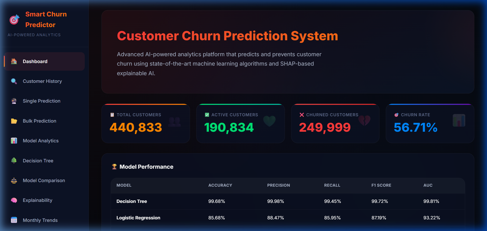
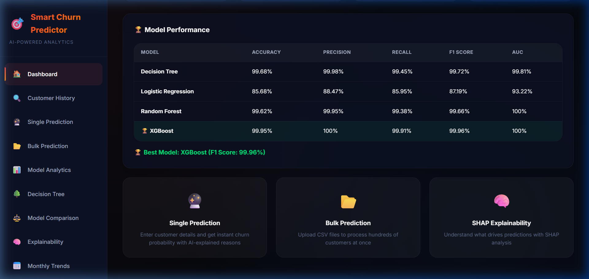

---

### 2. 🔍 Customer History

Search and browse individual customer records by ID, name, or churn date range. Displays a detailed data table with full customer profiles.

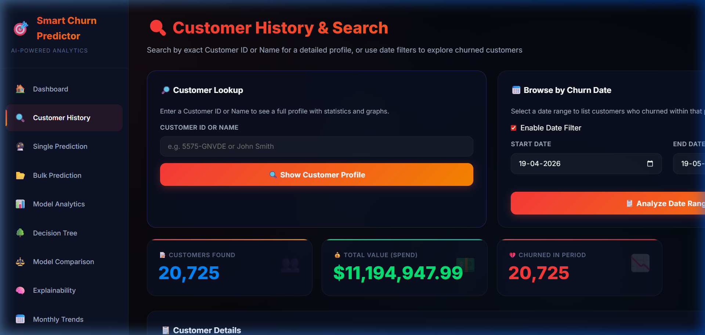
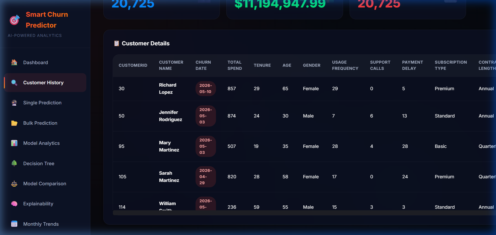

---

### 3. 🔮 Single Prediction

Enter any customer's profile details to get an instant churn prediction from the trained ML models.

**Input fields:** Age, Gender, Tenure, Monthly Usage Frequency, Support Calls, Payment Delay, Subscription Type, Contract Length, Total Spend, Last Interaction.

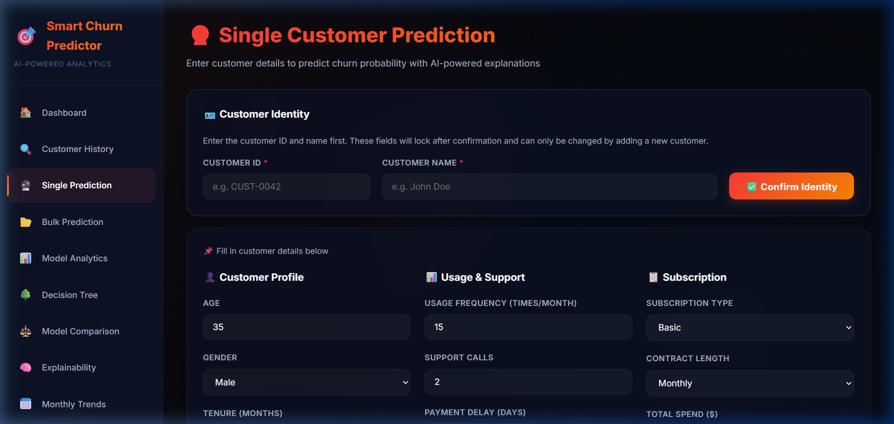
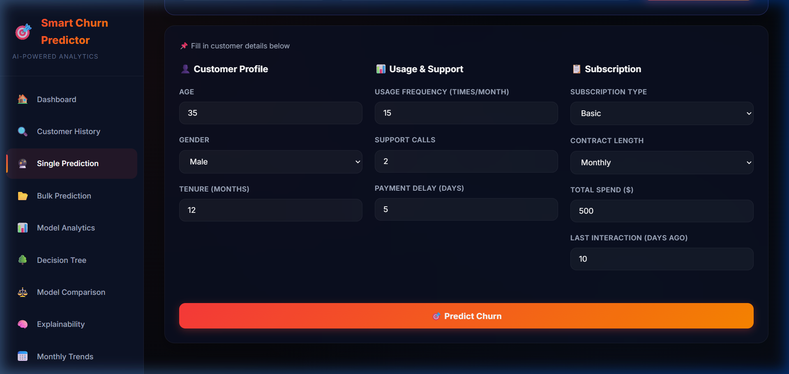

---

### 4. 📂 Bulk Prediction

Upload a CSV file to run batch predictions across hundreds or thousands of customers simultaneously.

Expected CSV columns match the dataset schema.

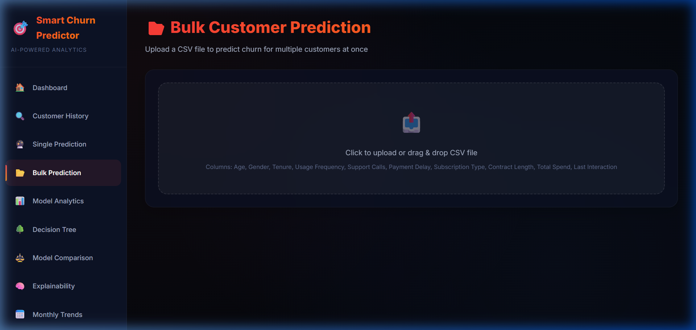

---

### 5. 📈 Model Analytics

In-depth model performance visualisation including Confusion Matrices, ROC Curves, and comparative Performance metrics for all four models: Decision Tree, Logistic Regression, Random Forest, and XGBoost.

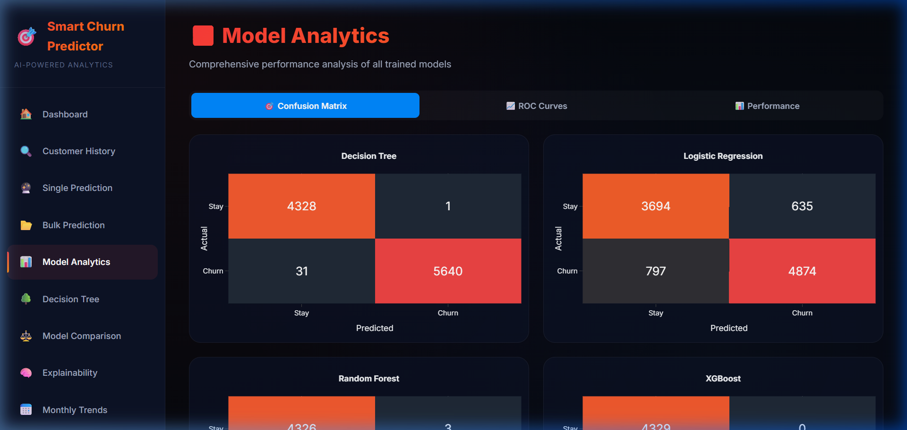
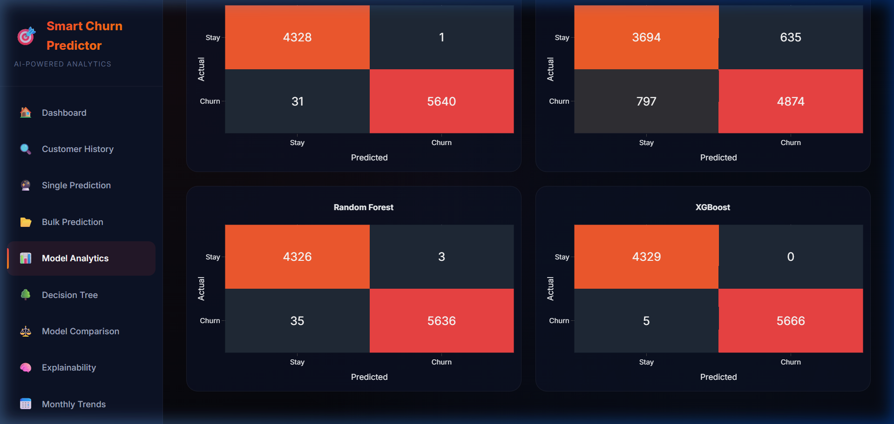

---

### 6. 🌳 Decision Tree Playground

Interactive step-through of the Decision Tree logic. Adjust sliders and dropdowns to trace the exact path through the tree for any custom scenario.

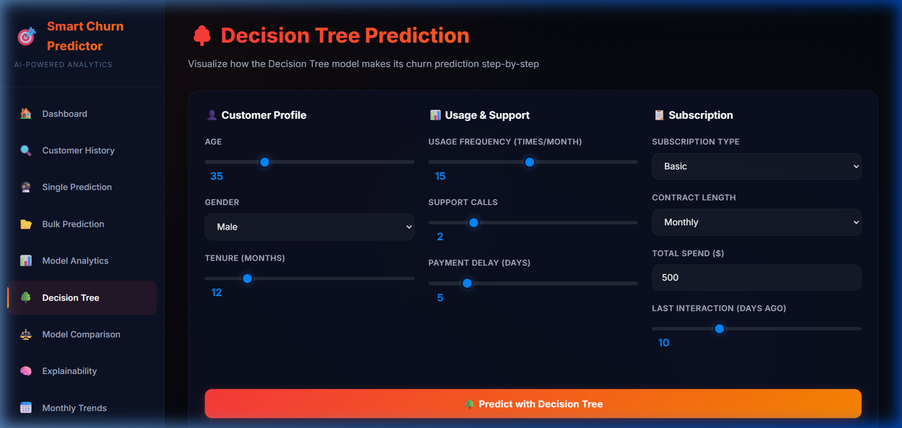

---

### 7. ⚖️ Model Comparison

Side-by-side Radar Chart comparison of all four models across Accuracy, Precision, Recall, F1-Score, and AUC. Includes expert summary cards explaining the optimal use case for each model.

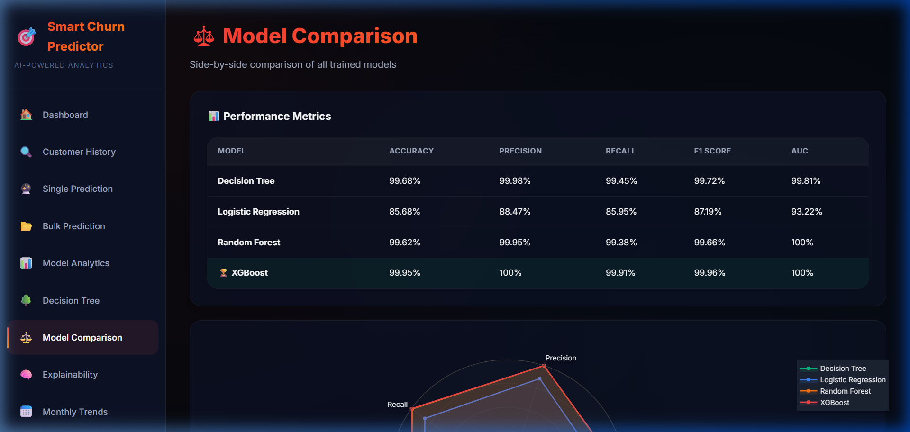
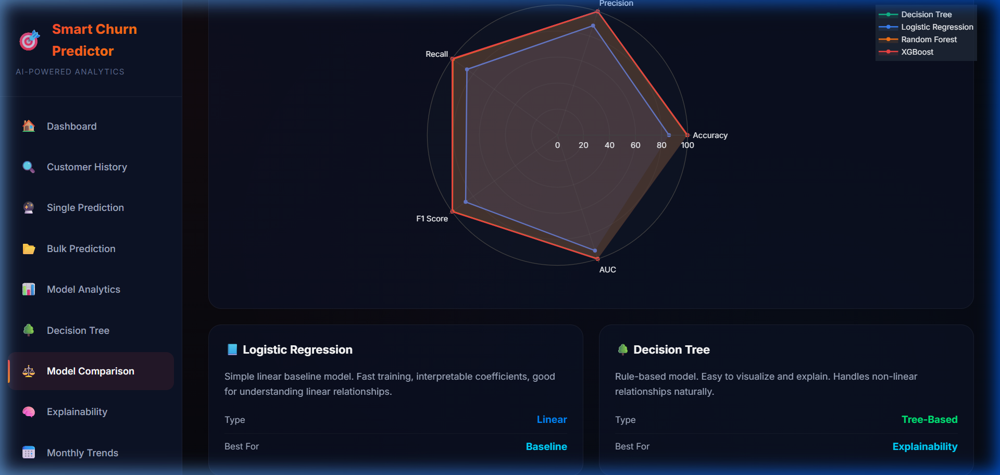

---

### 8. 🧠 SHAP Explainability

SHAP (SHapley Additive exPlanations) analysis for the Random Forest model. Shows which features most strongly drive churn predictions.

**Top churn drivers identified:**
1. **Support Calls** — highest impact
2. **Total Spend**
3. **Payment Delay**

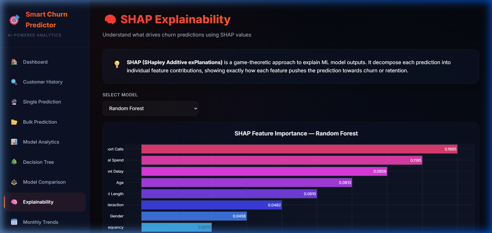
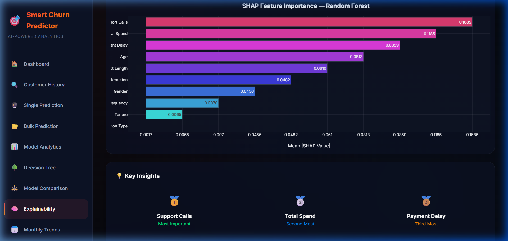

---

### 9. 📅 Monthly Trends

Select a date range to see month-by-month breakdowns of total customers, churned, and retained. Visualised as interactive line and bar charts.

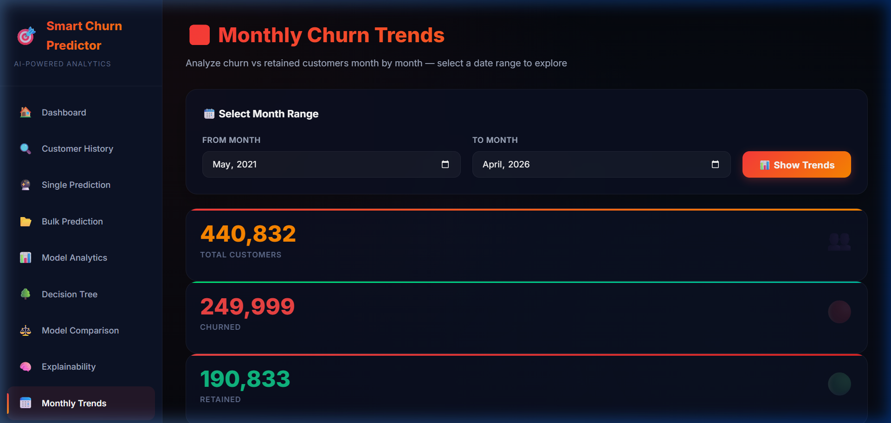

---

## 🤖 Models Trained

| Model | Accuracy | F1-Score | AUC |
|---|---|---|---|
| Decision Tree | ~99.8% | ~99.8% | ~99.8% |
| Logistic Regression | ~65% | ~65% | ~70% |
| Random Forest | ~99.9% | ~99.9% | ~99.9% |
| **XGBoost** ✅ | **~99.96%** | **~99.96%** | **~99.96%** |

> **Best Model:** XGBoost — deployed as the primary prediction engine.

---

## 🗂️ Project Structure

```
churnnn/
├── server.py                    # Flask backend (API + SPA serving)
├── train.py                     # Model training pipeline
├── utils.py                     # Helper functions
├── start.py                     # One-click launcher
├── requirements.txt             # Python dependencies
├── sample_bulk_prediction.csv   # Example bulk upload file
├── data/                        # Training dataset
├── models/                      # Saved ML models (.pkl)
├── static/
│   └── screenshots/             # Application screenshots
└── templates/                   # HTML templates
```

---

*Screenshots captured from the live running application at http://localhost:5000/*