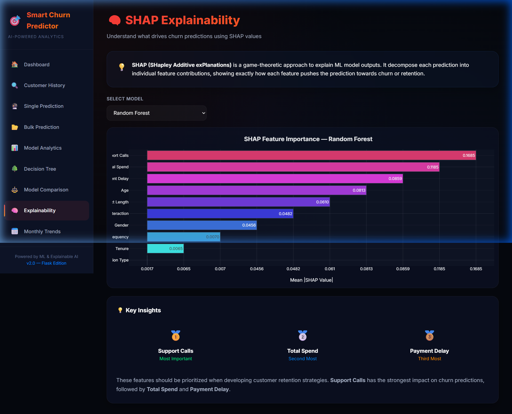
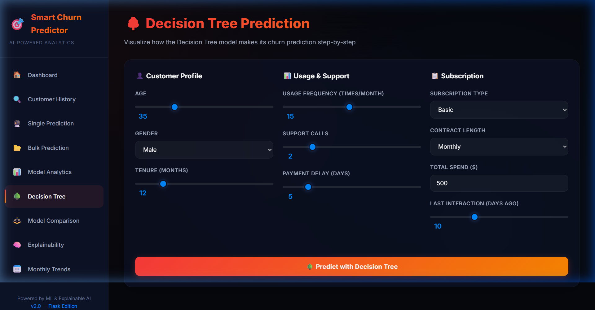
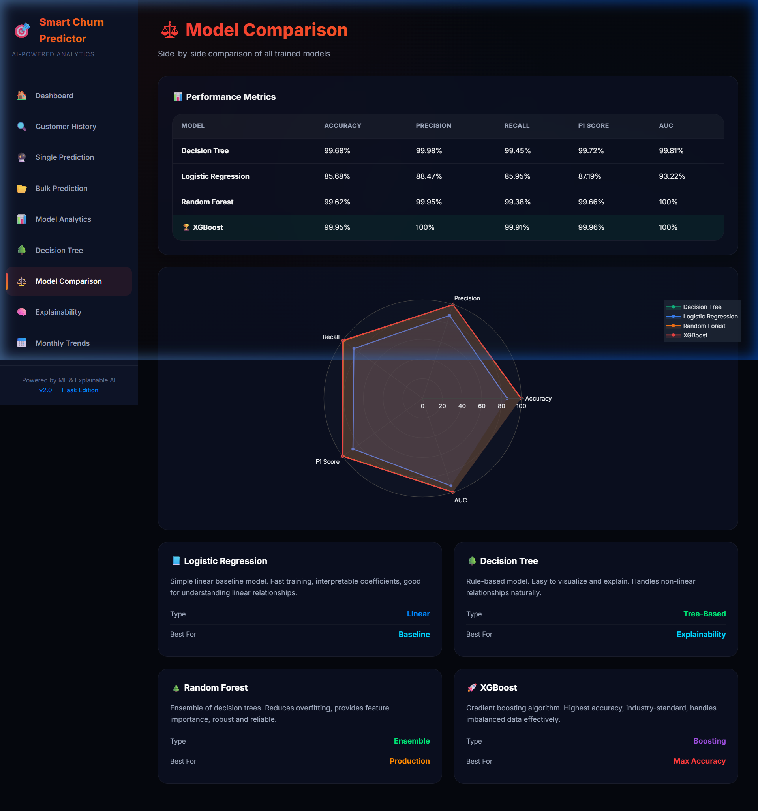
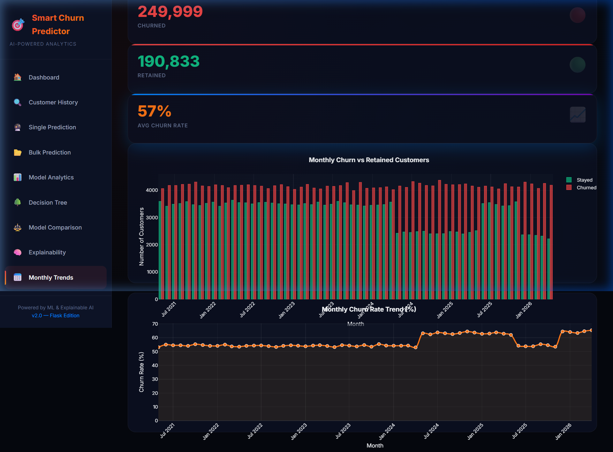

# 📊 Dataset & Application Gallery

---

## 🗂️ Dataset Source

> **Kaggle Dataset:** [Customer Churn Dataset — Muhammad Shahid Azeem](https://www.kaggle.com/datasets/muhammadshahidazeem/customer-churn-dataset)

The dataset used in this project is sourced from Kaggle and contains **440,833 customer records** with features covering demographics, service usage, billing behaviour, and subscription details.

| Property | Details |
|---|---|
| **Source** | Kaggle |
| **Author** | Muhammad Shahid Azeem |
| **Records** | ~440,833 rows |
| **Features** | Age, Gender, Tenure, Usage Frequency, Support Calls, Payment Delay, Subscription Type, Contract Length, Total Spend, Last Interaction |
| **Target** | `Churn` (1 = Churned, 0 = Stayed) |
| **Link** | https://www.kaggle.com/datasets/muhammadshahidazeem/customer-churn-dataset |

---

## 🖼️ Application Screenshots

### 1. 📊 Dashboard — Overview & KPIs

The main dashboard displays live KPIs: total customers, active vs. churned counts, overall churn rate, and a model performance comparison table.

---

### 2. 👥 Customer History & Search

Search and browse churned customer records. Filter by date range or search by Customer ID / Name to retrieve full profiles.

---

### 3. 🔮 Single Prediction

Enter individual customer details to get a real-time churn probability score, risk level classification, and SHAP-powered explainability reasons.

---

### 4. 📂 Bulk Prediction

Upload a CSV file to run batch predictions across hundreds or thousands of customers at once, with cohort risk distribution charts.

---

### 5. 📈 Model Analytics

Deep-dive into ML model performance metrics — interactive ROC curves, confusion matrices, and feature importance rankings for all 4 trained models.

---

### 6. 🧠 SHAP Explainability

View SHAP (SHapley Additive exPlanations) feature importance values for Random Forest and XGBoost, revealing which features drive churn predictions the most.

---

### 7. 🌳 Decision Tree Prediction

Visualise exactly how the Decision Tree model makes its churn decision, step-by-step — with interactive sliders for each customer feature.

---

### 8. ⚖️ Model Comparison

Side-by-side comparison of all 4 trained models using a radar chart spanning Accuracy, Precision, Recall, F1 Score, and AUC — plus individual model detail cards.

---

### 9. 📅 Monthly Trends

Month-wise churn trend analysis from 2021 to 2026 — stacked bar charts showing churned vs. retained customers per month, plus a churn rate trend line.

---

  <b>Dataset by Muhammad Shahid Azeem on Kaggle</b> 
  <a href="https://www.kaggle.com/datasets/muhammadshahidazeem/customer-churn-dataset">🔗 https://www.kaggle.com/datasets/muhammadshahidazeem/customer-churn-dataset</a>

