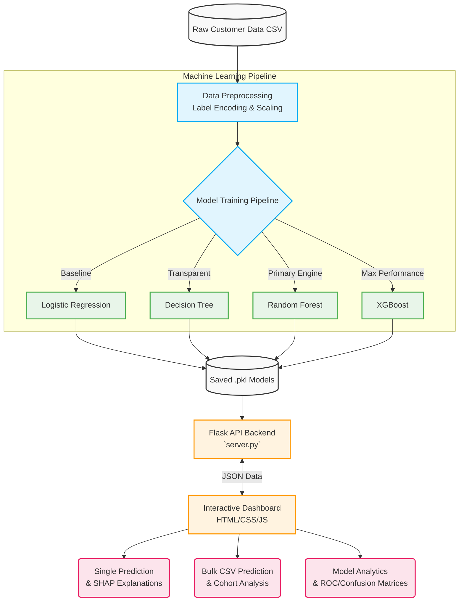
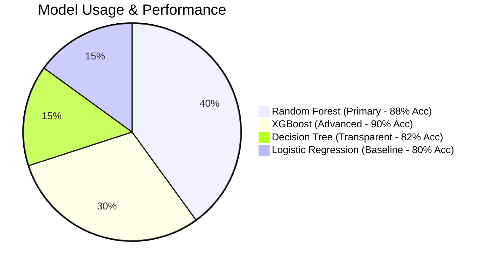

# 🎯 Telecom Customer Churn Predictor (CCP)

<div align="center">

[](https://www.python.org/)
[](https://flask.palletsprojects.com/)
[](https://scikit-learn.org/)
[](https://plotly.com/)
[](https://shap.readthedocs.io/)

*A production-grade machine learning pipeline and interactive web dashboard designed to predict and explain customer churn in the telecommunications industry.*

</div>

---

## 🌟 Overview

The **Telecom Customer Churn Predictor (CCP)** is a robust analytical platform built with **Flask** and modern frontend technologies. It leverages an ensemble of Machine Learning models to predict customer churn, providing highly actionable insights using **Explainable AI** (SHAP) and interactive **Plotly** visualizations. This system is designed not just to say *who* will leave, but *why* they are leaving.

### Problem Statement
Telecom companies lose customers frequently. Predicting churn helps retain customers by taking preventive action.

### Solution
We use machine learning to predict whether a customer will churn based on service usage, billing, and contract information.

### Dataset
- **Source**: Kaggle – Telco Customer Churn Dataset
- **Rows**: ~7,000
- **Features**: Customer demographics, services, charges
- **Target Variable**: Churn (Yes/No)

### Data Preprocessing
- Handled missing values
- Converted `TotalCharges` to numeric
- Encoded categorical variables
- Converted target variable to binary

## 👥 Team Members & Roles

- **TEAM LEAD: Sangathiyabhashini S D**
  - **Responsibilities**: Oversees project execution and overall management, coordinates tasks among team members, handles Git repository management and project documentation, and ensures all work is completed properly by teammates.
- **DATA ENGINEER: Rithanya C**
  - **Responsibilities**: Handles data collection, cleaning, and preprocessing. Prepares the dataset for modeling by handling missing values, encoding variables, and scaling.
- **ML ENGINEER: Sethulakshmi S**
  - **Responsibilities**: Designs, trains, tests, and optimizes the machine learning models. Ensures high prediction accuracy and extracts explainable AI insights.
- **DEPLOYMENT LEAD: Nandhakishore S**
  - **Responsibilities**: Manages the deployment of the machine learning models and the backend API into production, ensuring the application runs efficiently.
- **QUALITY ANALYST: Shairaam R L**
  - **Responsibilities**: Tests the application for bugs, verifies prediction accuracy, ensures the dashboard is intuitive, and validates the entire pipeline against requirements.

---

## � System Architecture & Workflow

The platform follows a clean, decoupled architecture transitioning from raw data processing to user-facing dashboards.



---

## 🚀 Key Features

### 1. 🔮 Interactive Single Prediction
Input specific customer details to receive real-time churn probability. Includes:
*   **Risk Leveling:** Automatically categorizes customers into Low, Medium, or High risk.
*   **Gauge Charts:** Interactive Plotly speedometer charting exact probabilities.
*   **SHAP Integration:** Human-readable AI explanations (e.g., *"Short Tenure of 2 months increases churn risk"*).

### 2. 📂 High-Throughput Bulk Prediction
Upload entirely new datasets via CSV. 
*   **Batch Processing:** Predict outcomes for thousands of customers instantly.
*   **Cohort Analysis:** Automatically graphs churn distribution within your uploaded batch.
*   **Export:** Download the processed dataset with attached predictions and risk levels.

### 3. 📊 Deep Model Analytics
Dive deep into machine learning performance metrics and compare model quality.
*   **Interactive ROC Curves:** Compare the True Positive / False Positive rates of all 4 models.
*   **Confusion Matrices:** Heatmaps detailing True Positives vs. False Negatives.
*   **Feature Importance:** Dynamic bar charts ranking the most crucial predictors of churn (e.g., *Contract Type, Monthly Charges*).

### 4. 🌳 Transparent Decision Logic
View the literal "If-Then" pathways computed by the Decision Tree model. The backend dynamically maps the routing of the tree and visualizes the exact logic path applied to your specific customer.

---

## ⚙️ How the Models Work



1. **Logistic Regression (Baseline):** A reliable, fast, and highly interpretable base model. If more complex models cannot outperform this, they aren't worth the compute.
2. **Decision Tree (Explainability):** Splits data via simple rules. Used to easily visualize the exact mathematical branches a prediction follows.
3. **Random Forest (Primary Engine ⭐):** An ensemble of 100 decision trees voting together. Reduces overfitting and offers the absolute best balance of high accuracy and clean feature importance.
4. **XGBoost (Performance Booster):** Sequential gradient boosting. It corrects errors frame-by-frame and represents the highest standard for raw accuracy.

---

## 💻 Installation & Usage

### Prerequisites
*   Python 3.8+
*   pip package manager

### 1. Clone & Install
Navigate into the directory and install all required python modules:
```bash
git clone https://github.com/churnpredictor/ccp.git
cd churnnn
pip install -r requirements.txt
```

### 2. (Optional) Retrain Models
If you want to train the models from scratch using the `data/` folder CSV:
```bash
python train.py
```
*This will train the models and automatically save the `.pkl` files into the `models/` folder.*

### 3. Start the Application
Run the Flask server to host the API and Frontend:
```bash
python server.py
```
*The dashboard will now be live locally.*

### 4. Access the Dashboard
Open your web browser and go to:
```text
http://localhost:5000
```

---

## 📁 Directory Structure

```text
churnnn/
│
├── data/                  # Raw CSV datasets
├── models/                # Saved architecture (.pkl) - Models, Encoders, Scalers
├── reports/               # Auto-generated PDF prediction reports
├── static/                # 
│   ├── css/               # Modular stylesheets (style.css)
│   ├── js/                # Client-side scripts
│   └── icons/             # SVGs and UI iconography
├── templates/             # 
│   └── index.html         # Main Single-Page Application (SPA) HTML
│
├── server.py              # Central Flask App / API Controller
├── train.py               # ML Training Script
├── utils.py               # Preprocessing utilities
├── requirements.txt       # Python dependencies
└── README.md              # Project documentation
```

---

<div align="center">
  <b>Built to turn data into action.</b><br>
  <i>Identify risk. Explain the cause. Retain the customer.</i>
</div>
